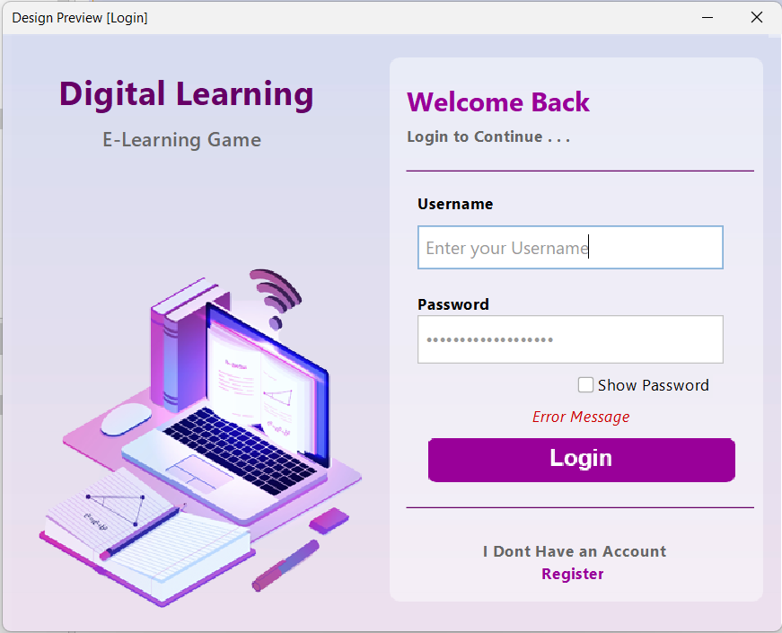
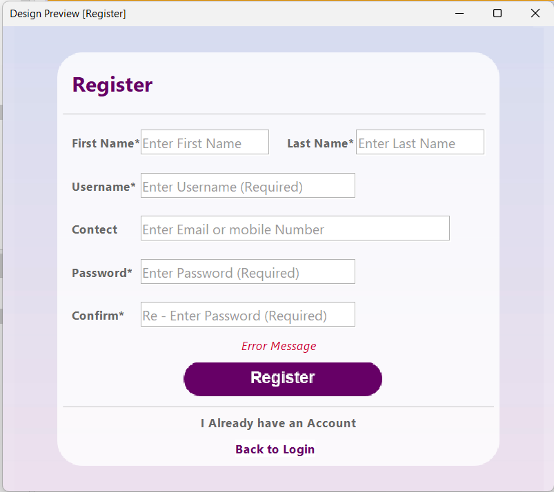

# Digital-Learning-Game-LMS-java
A Java-based gamified learning management system for Grade 10 and 11 students, enhancing engagement and comprehension through interactive quizzes and challenges. Features seamless user experience, comprehensive scoring, and secure MySQL data management. Winner of the Merit Award at SLIIT Code fest.

Here is the README file for your GitHub project, including placeholders for the screenshots:

---

# Digital Learning Game (LMS)

A Java-based gamified learning management system for Grade 10 and 11 students, enhancing engagement and comprehension through interactive quizzes and challenges. Features seamless user experience, comprehensive scoring, and secure MySQL data management. Winner of the Merit Award at SLIIT Code fest.

## Key Features

- **Seamless User Experience:** Effortless registration, secure login, and personalized profile management.
- **Comprehensive Scoring System:** Subject-specific scores and a dynamic leaderboard for motivation.
- **Interactive Learning Modules:** Tailored quizzes and challenges for deep learning.
- **Skill Development:** Additional game categories foster creativity, critical thinking, and strategic skills.

## Technological Foundation

- **Cross-Platform Compatibility:** Java-based platform ensures accessibility on diverse devices.
- **Secure Data Management:** Integrated with MySQL for safe and efficient student progress data handling.

## Educational Impact

- **Academic Excellence:** Empowers mastery through engaging gameplay.
- **Holistic Growth:** Nurtures problem-solving and creativity for lifelong success.

## Project Structure

- **Database Dump:** Contains the MySQL database dump file.
- **DigitalLearningGame:** Contains the Java project files.
- **Screenshots:** Contains screenshots of the application.
- **UI Design Source:** Contains the UI design source file.

## Setup Instructions

1. **Download and Open the Project:**
   - Open the `DigitalLearningGame` folder in NetBeans.
   
2. **Import the Database:**
   - Import the MySQL database from the `Database Dump` folder.
   
3. **Configure Database Connection:**
   - Change the `userName`, `password`, `host`, `port`, and `dbName` in the `db.java` file located in the `Database` package.

   

4. **Run the Project:**
   - Ensure the project is running smoothly in NetBeans.

---
# Screenshots

## Login Package
- **Login:**
  

 ****
  
- **Register:**
  

---

## Main Package
- **Dashboard Describe:**
  
- **Green:** Showcase our personal Details. Like Full Name, Username, TotalScore and Total completed Percentage
- **Red:** Showcase All the subject and thair Total Marks and Total Completed Percentage Individualy
- **Blue:** Showcase top ranged student Details

****
 
- **All Score:**
  

****

- **Profile Management:**
  

****

---

## Maths Package
- **Mathematics Main Menu:**
  

****

### Basic Maths

- **Maths - Basic Maths Game:**
  

****

### Perimeter and Area 

 - **Maths - Perimeter and Area Menu:**
  

****

- **Maths - Perimeter and Area - Circle Game:**
  

****

- **Maths - Perimeter and Area - Rectangle Game:**
  

****

- **Maths - Perimeter and Area - Square Game:**
  

****

- **Maths - Perimeter and Area - Triangle Game:**
  

****

---

## Science Package

- **Science Main Menu:**
  

****

### Electronic configuration

- **Science - Electronic configuration - Electronic configuration Game:**
  

****
  
- **Science - Electronic configuration - Periodic Table Game:**
  

****

### Biological Process in Human Body

- **Science - Biological Process in Human Body Menu:**
  

****

- **Science - Biological Process in Human Body - Digestive System:**
  

****
  
- **Science - Biological Process in Human Body - Respiratory System Game:**
  

****
  
- **Science - Biological Process in Human Body - Urinary System Game:**
  

****

---

## ICT Package

- **ICT Main Menu:**
  

****

### Information Communication Technology

  
- **ICT - Information Communication Technology Menu:**
  

****

- **ICT - Information Communication Technology - Fill in the Blanks Game:**
  

****
  
- **ICT - Information Communication Technology - MCQ Game:**
  

****

### Information Communication Technology

- **ICT - Fundamentals of a Computer System - Fill in the Blanks Game:**
  

****
  
- **ICT - Fundamentals of a Computer System - MCQ Game:**
  

****
  
- **ICT - Fundamentals of a Computer System Menu:**
  

****

### Logic Gates

- **ICT - Logic Gates Menu:**
  

****
  
- **ICT - Logic Gates - Basic Logic Gates Game:**
  

****
  
- **ICT - Logic Gates - Boolean to Map Game:**
  

****

### Logic Gates

- **ICT - Number System Menu:**
  
  
****

- **ICT - Number System - Addition Base 2 Game:**
  
  
****
  
- **ICT - Number System - Addition Base 8 Game:**
  
  
****
  
- **ICT - Number System - Addition Base 10 Game:**
  
  
****
  
- **ICT - Number System - Addition Base 16 Game:**
  
  
****

---

## Entertainment Package

- **Entertainment Main Menu:**
  
****

- **Entertainment - Odd Even Game:**
  
****
  
- **Entertainment - Tic Tac Toe Game:**
  
  

  

---
---
# Other Images

- **Database in MySQL:**
  
  ****

- **Project Packages:**
  
  

  
